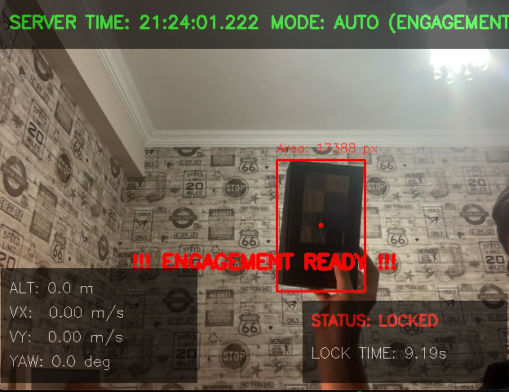

# 🦅 SkyHunter-D21X: AI-Powered Autonomous UAV Tracking & Engagement System




**SkyHunter-D21X**, TEKNOFEST Savaşan İHA (Avcı Drone) yarışması standartları için geliştirilmiş, **Ultra-Düşük Gecikmeli** otonom takip ve angajman sistemidir.

## 🚀 Öne Çıkan Özellikler

*   **Hibrit Görsel Takip**: YOLOv8-Nano ile periyodik hedef tespiti ve OpenCV KCF ile yüksek FPS'li (30+) kesintisiz takip.
*   **Hassas Durum Tahmini**: 4-durumlu Kalman Filtresi (x, y, vx, vy) ile gürültülü GNSS verisinin temizlenmesi ve veri kaybı anında hedef konum tahmini.
*   **Angajman Yönetimi (Lock Manager)**: Yarışma kurallarına uygun 10 saniyelik pencerede toplam 5 saniye kilitlenme süresi takibi ve atış kararı üretimi.
*   **MAVLink Haberleşme**: SITL simülasyonu ve gerçek uçuş kontrolcüleri (Pixhawk vb.) ile tam uyumlu telemetri ve hız komutu (NED) yönetimi.
*   **Gerçek Zamanlı HUD Arayüzü**: Düşük gecikmeli OpenCV tabanlı gösterge paneli (İrtifa, Hız, Mod, Kilit Durumu).
*   **Görev Kaydı**: Her uçuşun video kaydı (MP4) ve sistem logları.

## 🛠️ Kurulum

Sistemi yerel ortamınızda çalıştırmak için aşağıdaki adımları izleyin:

1. **Depoyu klonlayın:**
```bash
git clone https://github.com/kullaniciadi/d21x-autonomous-tracking.git
cd d21x-autonomous-tracking
```

2. **Gerekli paketleri yükleyin:**
```bash
pip install ultralytics opencv-python pymavlink numpy
```

## 🎮 Kullanım

Ana sistemi başlatmak için:

```bash
python main.py
```

*   **'M' Tuşu**: Manuel Override (Otonom yönetimi devre dışı bırakır).
*   **'Q' veya ESC**: Programı güvenli bir şekilde kapatır ve kayıtları kaydeder.

## 📁 Dosya Yapısı

- `main.py`: Sistemin giriş noktası ve çoklu thread yönetimi.
- `vision_pipeline.py`: YOLO ve KCF entegrasyonu.
- `mavlink_comm.py`: MAVLink haberleşme ve telemetri protokolü.
- `kalman_filter.py`: GNSS verisi düzeltme ve tahmin modülü.
- `lock_manager.py`: Kilitlenme süresi ve angajman mantığı.
- `gcs_ui.py`: OpenCV tabanlı yer istasyonu arayüzü.
- `train_yolo.py`: YOLOv8 modeli eğitim scripti.

## 🛡️ TEKNOFEST Uyumluluğu

Bu proje, Savaşan İHA Avcı Drone kategorisindeki:
- "En az 5 saniye kilitlenme"
- "Video aktarımı üzerinden otomatik kilitlenme"
- "Görsel takip algoritmaları"
gereksinimlerini karşılayacak şekilde mimari edilmiştir.

## ⚖️ Lisans

Bu proje MIT Lisansı ile korunmaktadır.
